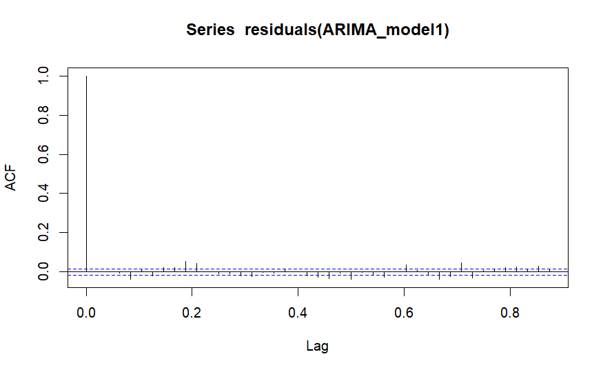
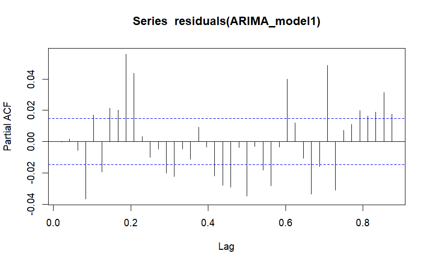
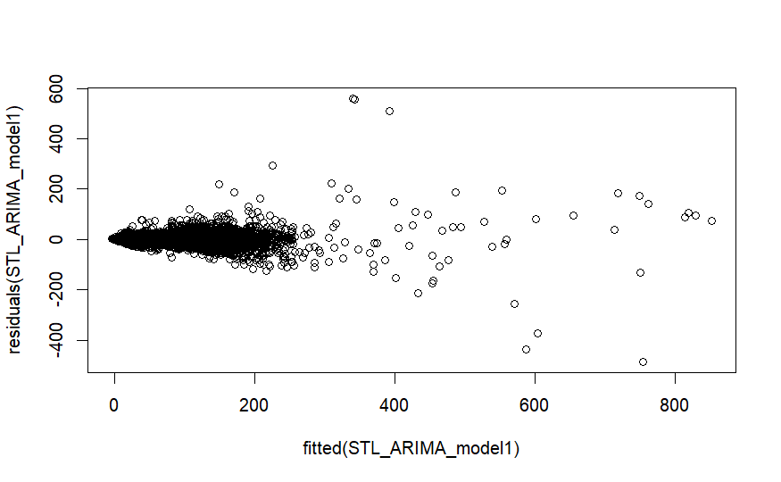
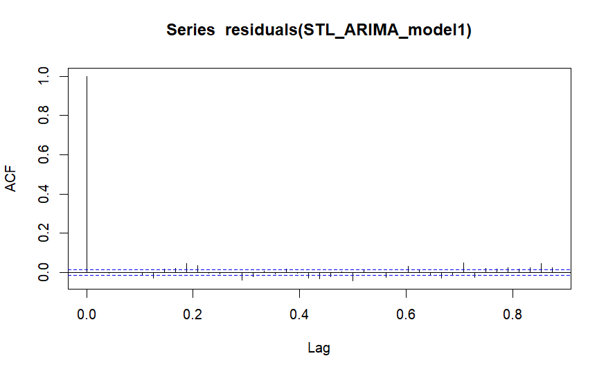
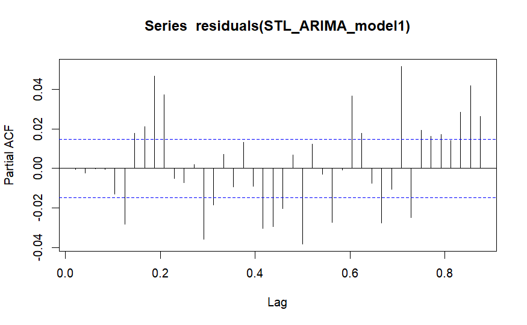
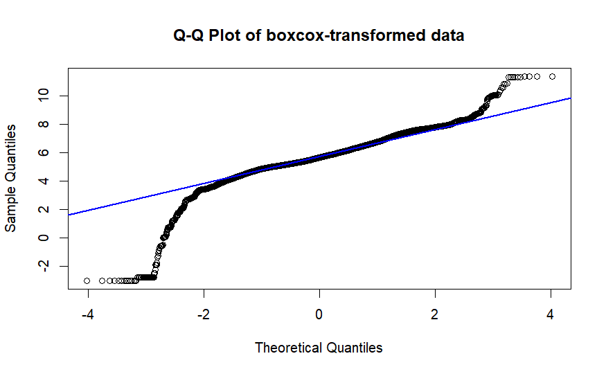
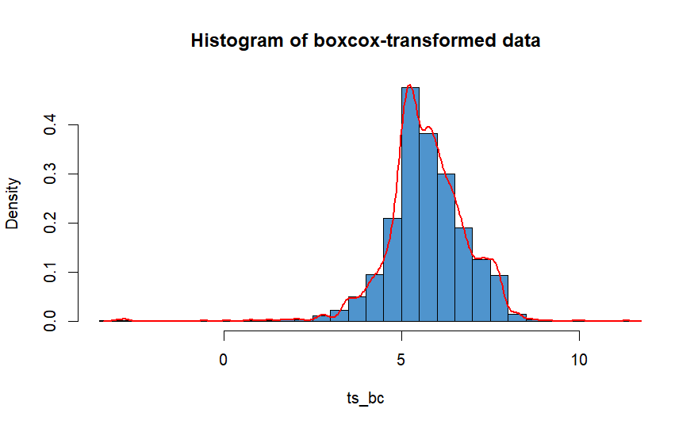
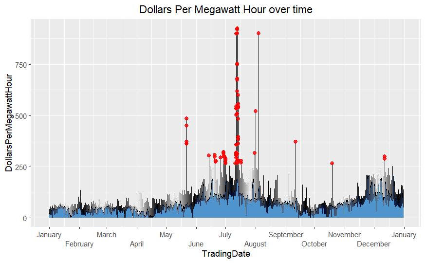

# ARIMA-Energy-Price-Forecaster
## Summary
Forecasted New Zealand energy prices using one year of half hourly data from the New Zealand Electricity Authority. Conducted stationarity diagnostics and applied first-order differencing to stabilize the series. Performed autocorrelation and partial autocorrelation analysis to inform model development. Built and evaluated four forecasting models ARIMA, STL-ARIMA, ARIMAX, and TBATS. Compared model performance using forecast accuracy metrics including ME, MAE, and RMSE.

The  ARIMA(3,1,1)(0,0,2)[48] demonstrated the highest accuracy across the ME, RMSE, MAE, MPE, MAPE, and ACF1 metrics.

This project was made using RStudio.

# Data cleaning and wrangling
I loaded in the training set which was 12 months of half hourly data from the Electricity Authority.

I restricted the dataset to one Point of Connection (ABY0111) for simplicity.

I ensured that the datasets variables were classified correctly.

The TradingDate variable was a date object ranging from 2017-01-01 to 2017-12-31.

The TradingPeriod variable gives the 30 minute interval where electricity was bought and sold. It was numerical.

The PointOfConnection variable was an ordinal categorical variable, it gives the grid location where electricty is entering (or exiting) a network. I’m only forecasting with the ABY0111 point of connection.

The DollarsPerMegawattHour variable was numerical, it gives the wholesale price of electricity. It’s the price at which electricity was bought and sold in the wholesale market at a specific date and time, and point of connection.

The TradingPeriod had a max value of 50 even though there are only 48 trading periods in New Zealand’s electricity market. This was because daylight savings ended on 2017-04-02 and clocks were turned back one hour, meaning there was an extra hour for that day, resulting in two more 30 minute trading periods
I removed these observations from the dataset as I wanted to maintain a consistent daily structure, which is important for ARIMA.

There were no missing values or NA's in the dataset

# EDA

There were very few values above 400 for DollarsPerMegawattHour. The mode for DollarsPerMegawattHour was around 70 dollars. There were no negative values for DollarsPerMegawattHour.

There are 34 observations where the DollarsPerMegawattHour value was larger than the 400, which in a data set of 17158 observations was very few.

The mean DollarsPerMegawattHour for year 2017 at point connection ABY0111 was 78.57 (round to 2.dp)

I saw that there were specific dates where the whole sale price of electricity spiked to unusually high amounts.
There were spikes in electricity price on 2027-05-22, 2017-07-13, 2017-09-11, and 2017-10-19.

The price of electricity was much higher for June and July. The lower quartile of June and July doesn't even overlap with the upper quartiles of the previous months.
The prices dip again for August, September and October but then start increasing again in November and December.

# Autocorrelation & Partial Autocorrelation Analysis

ACF:
I saw that all of the spikes in the ACF plot are outside of the blue dashed significance bound this means that the time series data was highly autocorrelated and non-stationary. The autocorrelation at all of the lags was statistically meaningful and not just white noise. Past values have a strong influence on future ones across many lags.
There was particularly high autocorrelation at the early lags. This suggests that recent values strongly influence near future behavior, implying short term memory or an autoregressive structure.
There was a spike at around every 48 lags which suggests a seasonal pattern.
The bars gradually decay suggesting a persistent trend or that it's non-stationary. This suggests the mean and variance may be changing over time, and the structure could be due to an autoregressive process or an underlying seasonal component.

PACF:
There was a large spike at lag 1 in the PACF plot suggesting that the current price was heavily influenced by the immediate past period. This spike at lag 1 suggests an AR(1) structure. This supports the idea that the series has short-term autoregressive structure.
Past lag 1 there was gradual tapering, rather than a sharp cutoff like a pure AR(p) process.

Conclusion:
All of the above information from the ACF and PACF plots suggests that the data was non-stationary and that there could be a seasonal component to the data.
I applied first order differencing to the data to make the data stationary, as stationary data is a requirement of ARIMA.

The subsequent acf and pacf plots for the first order differenced time series were:

ACF:
After applying first order differencing most lags in the ACF plot were within the confidence bounds, meaning there was no strong autocorrelation.
There was no sharp cutoff or pattern in the plot. There were no clear periodic spikes (e.g. at lag 48), which indicated that there was no seasonality left.
The ACF plot no longer shows a slow decay, instead there are isolated significant spikes in the plot. This pattern indicated that the trend had been removed and that the series was now stationary, with stable mean and variance over time.

PACF:
There was a moderate spike at lag 1, outside the confidence bounds. Most subsequent lags are within the confidence bounds. This suggests a short term autoregressive pattern. This means each electricity price was influenced by its immediate predecessor.
The decay after the first lag also supports that the first order differencing has stabilized the series, leaving behind no long range autocorrelation.
Since this resembles an AR(1) structure still, when I fitted the ARIMA model I included an AR(1) component to model the autoregressive behavior.

# Stationarity Diagnostics: ADF, KPSS & Phillips–Perron

I performed an Augmented Dickey-Fuller test and Phillips–Perron test both of which had a p-value of less than 0.01, due to the small p-value I concluded that the differenced series was stationary. The KPSS test had a p-value larger of 0.5 as a result I concluded that the differenced series was stationary.

# Accuracy metrics

I fitted four models:

ARIMA(3,1,1)(0,0,2)[48]

STL-ARIMA(5,1,1)

An ARIMAX model where the xreg arguement had five predictors (Day_of_Week, Is_Weekend, Month, Hour_of_Day, Is_peak)

A TBATS model with included ARMA errors.

They were all trained on a time series containing 12 months of half hourly final energy price data from 2017-01-01 to 2017-12-31.

After forecasting with those models I obtained the accuracy metrics:

|              | ARIMA          | ARIMAX  | STL-ARIMA | TBATS |
|--------------|----------------|----------|---------|-----------|
| ME | 6.13    | 53.023     | 11.08    | 12.63  |
| RMSE | 18.29 | 55.87   | 21.15  | 23.62    |
| MAE | 12.67  | 53.03    |  16.55 | 19.15 |
| MPE | 3.13   | 58.91 | 8.99 | 10.28 |
| MAPE | 14.33 | 58.91 | 18.40 | 21.44 |
|MASE |0.65 | 2.72 | 0.85 | 0.98 |
| ACF1 | 0.62  | 0.63 | 0.63 | 0.72 |

The ARIMA model has the best ME, RMSE, MAE, MPE, MAPE and MASE. ARIMA was the most accurate model.
The worst model was ARIMAX with the worst ME, RMSE, MAE, MPE, MAPE and MASE. The second worst model was TBATS.
All models have similar ACF1 values which suggests that the residuals for all models still have short range correlation.
The MASE for ARIMA and STL-ARIMA was less than 1 which means they beat a naive “yesterday’s price” benchmark on average absolute error.
I decided to check the residuals of the ARIMA and STL-ARIMA models and perform model refinement. I did not be continue with the worst performing models ARIMAX and TBATS.

# Structural checks and Statistical diagnostics
## Autocorrelation check with Ljung Box test, acf and pacf plots:
### ARIMA model
The p-value from the Ljung Box test was extremely small as a result I rejected the null hypothesis that there was no autocorrelation in the residuals and concluded that there was autocorrelation in the residuals. This means that the ARIMA model hadn’t fully captured the time-dependent structure in the series.

For Anderson-Darling normality test the p-value was very small, so I rejected the null hypothesis that the residuals are normally distributed and concluded that the residuals were non-normal.

Checking for constant variance:

As the fitted values increase, the residuals fan out, showing increasing variance.
There’s a tight cluster around zero residuals for lower fitted values

Most autocorrelation bars fall within the dashed blue confidence bands, suggesting they’re not statistically significant.
There was no strong pattern of lingering autocorrelation. The residuals behaved like white noise.

Most lags fell within the blue dashed confidence bands, meaning their partial autocorrelations weren’t statistically significant.
There are a few spikes outside of the confidence bounds, particularly at lag 1 suggesting short-term autocorrelation. This implied that the AR term (p) was slightly under-specified. I tried increasing the AR component to try and capture the remaining autocorrelation.

### STL-ARIMA model
The p-value from the Ljung Box test was extremely small as a result I rejected the null hypothesis that there was no autocorrelation in the residuals and concluded that there was autocorrelation in the residuals. This means that the STL-ARIMA model hadn’t fully captured the time-dependent structure in the series.

For Anderson-Darling normality test the p-value was very small, so I rejected the null hypothesis that the residuals were normally distributed and concluded that the residuals were non-normal.

As the fitted values increase, the residuals fan out, showing increasing variance. There’s a tight cluster around zero residuals for lower fitted values.

The models residuals were like white noise, most of the bars were within the confidence bounds

There are significant spikes outside the confidence bands, this suggests that there are lags that aren’t captured by my current AR structure.
I tried increasing the AR component to try and capture the remaining autocorrelation.

# Model refinement
I applied a box cox transformation to the time series to try and resolve the non-normality.

There was a curved pattern in the data which indicated that the data was skewed or was not normally distributed

The data was not centered around zero, so its not a standard normal distribution. The data also appeared to be right skewed. This plot indicated that the data was not normally distributed.

For the Anderson-Darling normality test it had a small p-value which indicate that the data was still not normal even after a BoxCox transformation

The data was not normally distributed, but the box-cox transformed time series was closer to a normal distribution than the untransformed time series, so I continued using it for further modelling.

I checked for outliers with Tukey’s Fences and visualized that in a time series plot where each red dot was an outlier:

There are 84 outliers according to Tukey’s Fences. Since energy prices are so volatile, I decided  not to discard the outliers in the series.

For both models (ARIMA and STL-ARIMA) I increased the AR component by 1, and applied a box-cox transformation to the time series data.
I now had:
ARIMA(4,1,1)(0,0,2)[48]
STL-ARIMA(6,1,1)

# Model assessment
I forecast 48 trading periods for twelve months

I made sure to apply an inverse box cox transformation on the forescasts to obtain interpretable electricity price predictions since the ARIMA 2 and STL-ARIMA 2 models were trained on a box cox transformed time series.

|              | ARIMA          | ARIMA 2  | STL-ARIMA | STL-ARIMA2 |
|--------------|----------------|----------|---------|-----------|
| ME | 6.13    | 18.06     | 11.08    | 18.53  |
| RMSE | 18.29 | 102.20   | 21.15  | 101.73    |
| MAE | 12.67  | 52.88    |  16.55 | 52.67 |
| MPE | 3.13   | -2087.01 | 8.99 | -1987.80 |
| MAPE | 14.33 | 2115.23 | 18.40 | 2016.87 |
| ACF1 | 0.62  | 0.90 | 0.63 | 0.91 |

The model that performed best was my original ARIMA model, my second best model was my original STL_ARIMA model.
It seems my refinement of the models made their performance worse.
The best model was ARIMA(3,1,1)(0,0,2)[48] and the worst model was STL-ARIMA 2

This plot shows my ARIMA model forecast for the final half hourly electricity prices for the year 2018 compared to the actual values for that year.

There are large fluctuations in the actual electricity prices, particularly in July and November.

The forecast as shown by the blue dashed lines appears to follow the overall trend of electricity prices. Its 95% confidence interval (the light blue ribbon) covers the majority of the electricity prices for 2018 but misses many large spikes between June and December which means the model was underestimating the real volatility.

However it does model the initial five months January to May quite well.

Due to the models issues with volatility if I were to continue forecasting the 2018 energy price data with another model I would consider a GARCH model as it is good for modelling volatility clustering.

# Conclusion
The best model was the ARIMA model: ARIMA(3,1,1)(0,0,2)[48].

Its non-seasonal component had AR(3) (which captured short term autocorrelation up to lag 3), I(1) (a first order differencing to make the data stationary), MA(1) (which corrected for noise and shocks using lag 1 residuals). Its seasonal component with a periodicity of 48 (the seasonality repeats every full day as there are 48 trading periods per day) and it did not include a seasonal AR or I (no seasonal autocorrelation or differencing) and had a seasonal MA(2) (uses forecast errors from 1 and 2 days ago (lags at 48 and 96 intervals) to adjust the current days forecast).

The models mean error was 6.13 which means on average its forecasts overestimate actual prices by about 6.13 dollars per megawatt hour.

The models root mean square error was 18.29 which indicates large forecast errors, since squared errors penalize larger errors more heavily this high RMSE value was probably due to how volatile the data is.

The models mean absolute error was 12.67 which means that forecasts were off by 12.67 units on average. This was 12.6% of the annual mean, the mean energy price for 2018 was 100.53, so the mean absolute error isn't that high considering how volatile the data is.

The mean percentage data was 3.13% which means that the model tends to forecast higher electricity prices than reality.

The mean absolute percentage error was 14.34% which means that the models forecasts were off by 14.34% on average.

The models MASE was 0.65 which is a scaled comparison to a naive model which means the ARIMA model outperforms a naive forecast.

The models ACF1 was 0.65 which indicates that the residuals are moderately autocorrelated so there was some structure or pattern in the data that the model did not capture.

The ARIMA model did better than the STL-ARIMA, ARIMAX and TBATS models which just shows that a more complex model does not equal a better performance, those other models were overfitting on the training data and not generalizing well enough to forecast the following year.

# References and Citations
Electricity Authority. (n.d.). Final energy prices by month [Dataset]. EMI – Electricity Market Informa-
tion. Retrieved between May 2 and July 13, 2025, from https://www.emi.ea.govt.nz/Wholesale/Datasets/
DispatchAndPricing/FinalEnergyPrices/ByMonth
