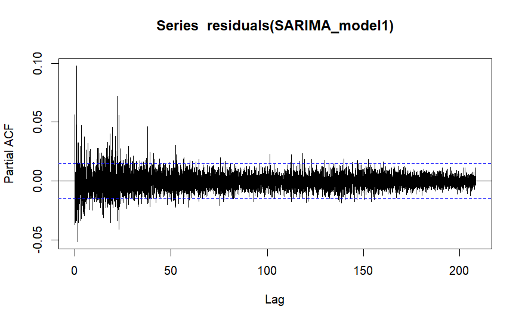

# ARIMA-Energy-Price-Forecaster
## Summary
Forecasted New Zealand energy prices using one year of half hourly data from the New Zealand Electricity Authority. Conducted stationarity diagnostics and applied first-order differencing to stabilize the series. Performed autocorrelation and partial autocorrelation analysis to inform model development. Built and evaluated five forecasting models ARIMA, SARIMA, STL-ARIMA, SARIMAX, and ARIMA-GARCH. Compared model performance using forecast accuracy metrics including ME, MAE, and RMSE.

The ARIMA(3,1,1) model, trained on the energy price data from 2017, demonstrated the highest performance on the 2018 validation set across the ME, RMSE, MAE, MPE, MAPE, and MASE evaluation metrics.

The SARIMAX(2,1,2)(0,0,1)[48] model, trained on both the 2017 and 2018 energy price data (with exogenous variables season, energy generation, and is_weekend), had the highest performance on the 2019 test set in regards to the ME, RMSE, MAE, Theil's U and MASE performance metrics.

This project was made using RStudio.

## Purpose: 
Research question: Which time series model most accurately predicts 2019 energy prices, using historical energy price data from 2017 and 2018?

My hypothesis was that an ARIMA model would outperform the more complex models in predicting 2019 energy prices using 2017 and 2018 data.

Model performance was assessed using ME, RMSE, MAE, MPE, MAPE and MASE.

My training set was energy price data from 2017, my validation set was 2018 data and my test set was 2019 data.

After refining the models parameters using the 2018 validation set, the final models were retrained on the combined the 2017 and 2018 datasets. The final models performance was evaluated using the 2019 data (the unseen test set).

Note that this project is only using one point of connection ABY0111 for simplicity, it was selected because it is the first point of connection alphabetically.

# Data cleaning and wrangling
I initally loaded in the training set of 2017 data, which consisted of 12 months of half hourly data from the Electricity Authority.

I restricted the dataset to one Point of Connection (ABY0111) for simplicity.

I ensured that the datasets variables were classified correctly.

The TradingDate variable was a date object ranging from 2017-01-01 to 2017-12-31.

The TradingPeriod variable gives the 30 minute intervals where electricity was bought and sold. It was numerical.

The PointOfConnection variable was an ordinal categorical variable, it gives the grid location where electricty is entering (or exiting) a network. I’m only forecasting with the ABY0111 point of connection.

The DollarsPerMegawattHour variable was numerical, it gives the wholesale price of electricity. It’s the price at which electricity was bought and sold in the wholesale market at a specific date and time, and point of connection.

The TradingPeriod had a max value of 50 even though there are only 48 trading periods in New Zealand’s electricity market. This was because daylight savings ended on 2017-04-02 and clocks were turned back one hour, meaning there was an extra hour for that day, resulting in two more 30 minute trading periods

I removed these additional observations from the dataset as I wanted to maintain a consistent daily structure, which is important for ARIMA.

Due to daylight savings 2017-09-24 had two less trading periods, to maintain a consistent daily structure I used linear interpolation to fill this gap.

There were no other missing values or NA's in the dataset

# EDA

There were very few values above 400 for DollarsPerMegawattHour. The mode for DollarsPerMegawattHour was around 70 dollars. There were no negative values for DollarsPerMegawattHour.

There are 34 observations where the DollarsPerMegawattHour value was larger than the 400, which in a data set of 17158 observations was very few.

The mean DollarsPerMegawattHour for year 2017 at point connection ABY0111 was 78.71 (round to 2.dp)

I saw that there were specific dates where the whole sale price of electricity spiked to unusually high amounts.
There were spikes in electricity price on 2027-05-22, 2017-07-13, 2017-09-11, and 2017-10-19.

The price of electricity was much higher for June and July. The lower quartile of June and July doesn't even overlap with the upper quartiles of the previous months.
The prices dip again for August, September and October but then start increasing again in November and December.

# Autocorrelation & Partial Autocorrelation Analysis

ACF:
I saw that all of the spikes in the ACF plot are outside of the blue dashed significance bound this means that the time series data was highly autocorrelated and non-stationary. The autocorrelation at all of the lags was statistically meaningful and not just white noise. Past values have a strong influence on future ones across many lags.

There was particularly high autocorrelation at the early lags. This suggests that recent values strongly influence near future behavior, implying short term memory or an autoregressive structure.
There was a spike at around every 48 lags which suggests a seasonal pattern.

The bars gradually decay suggesting a persistent trend or that it's non-stationary. This suggests the mean and variance may be changing over time, and the structure could be due to an autoregressive process or an underlying seasonal component.

PACF:
There was a large spike at lag 1 in the PACF plot suggesting that the current price was heavily influenced by the immediate past period. This spike at lag 1 suggests an AR(1) structure. This supports the idea that the series has short-term autoregressive structure.

Past lag 1 there was gradual tapering, rather than a sharp cutoff like a pure AR(p) process.

Conclusion:
All of the above information from the ACF and PACF plots suggests that the data was non-stationary and that there could be a seasonal component to the data.

I applied first order differencing to the data to make the data stationary, as stationary data is a requirement of ARIMA.

The subsequent acf and pacf plots for the first order differenced time series were:

ACF:
After applying first order differencing most lags in the ACF plot were within the confidence bounds, meaning there was no strong autocorrelation.

There was no sharp cutoff or pattern in the plot. There were no clear periodic spikes (e.g. at lag 48), which indicated that there was no seasonality left.

The ACF plot no longer shows a slow decay, instead there are isolated significant spikes in the plot. This pattern indicated that the trend had been removed and that the series was now stationary, with stable mean and variance over time.

PACF:
There was a moderate spike at lag 1, outside the confidence bounds. Most subsequent lags are within the confidence bounds. This suggests a short term autoregressive pattern. This means each electricity price was influenced by its immediate predecessor.

The decay after the first lag also supports that the first order differencing has stabilized the series, leaving behind no long range autocorrelation.

Since this still resembled an AR(1) structure, when I fitted the ARIMA model I included an AR(1) component to model the autoregressive behavior.

# Stationarity Diagnostics: ADF, KPSS & Phillips–Perron

I performed an Augmented Dickey-Fuller test and Phillips–Perron test both of which had a p-value of less than 0.01, due to the small p-values I concluded that the differenced series was stationary.

The KPSS test had a p-value larger of 0.5, as a result I concluded that the differenced series was trend stationary.

# Fitting the Models
I used auto.arima with first order differencing to find suitable ARIMA and SARIMA models that I could manually adjust later based on each models residuals. Those models were ARIMA(3,1,1) and ARIMA(3,1,1)(0,0,1)[48] respectively.

For STL-ARIMA(5,1,1) I enabled robust fitting for the model (robust = TRUE) to make it more resistant to outliers. The weighting function reduced the influence of outliers, causing most outliers to be captured in the remainder component. As a result, the trend and seasonal patterns are be preserved and more accurately reflected the underlying structure of the time series.

For the SARIMAX model I feature engineered three variables. Energy generation (gives the total energy generated for each trading period and date), Season (which gives the season for each observation) which was turned into three dummy variables (note that the dummy variable for autumn was dropped to avoid the dummy variable trap), and Is_Weeked (Which states whether any observation was on a weekday or a weekend).
The SARIMAX model is a regression framework with ARIMA(2,1,2)(0,0,1)[48] errors, where the exogenous variables explain variation in the response and the residuals follow a seasonal ARIMA process.

To identify the best ARIMA-GARCH model, I first evaluated which distribution (out of norm, ged, std, snorm, sstd) best fit the data by looking at kernel density plots. Then I made and used a grid search function that fit 108 different models combinations, varying the AR, MA, ARCH (p), and GARCH (q) orders across four volatility frameworks: sGARCH, fGARCH, and iGARCH. The best model was the ARMA(1,0) fiGARCH(1,1) model with the lowest AIC, BIC, Shibata and Hannan-Quinn.

All of the models were trained on a time series containing 12 months of half hourly final energy price data from 2017-01-01 to 2017-12-31.

# Accuracy Metrics for Validation set

The future xreg variable Energy Generation was forecasted using an ARIMA(3,0,1)(1,1,0)[48] with drift model rather than using the actual energy generation values. This was done because the actual values of energy generation won't be known ahead of time for forecasting, so I will need to estimate the values of this variable for testing and any real world usage. The model is ARIMA(2,1,2)(0,0,1)[48] errors.

I wanted to understand the models sensitivity to inaccurate energy generation values, to do this I made an additional SARIMAX model where the only difference was that Energy_Generation contained its real values.
I then compared it to my original SARIMAX model.

I obtained the following accuracy metrics by forecasting the energy prices for 2018 and comparing them against the actual 2018 values for each model:

| Model       | ME   | RMSE   | MAE   |  MPE |  MAPE | MASE  | ACF1   | Theil's U |
|-------------|------|--------|-------|-------|-------|-------|--------|-----------|
ARIMA         |4.25  | 18.39  |	13.12	| 0.61	| 15.29	| 0.67	| 0.65   | 1.38      |
SARIMA        |6.67	 | 19.18  |	13.62	| 3.44	| 15.51	| 0.70	| 0.65   | 1.38      |
STL_ARIMA     |4.65  |	19.77	| 14.90	| 0.82	| 17.62	| 0.76	| 0.69	 | 1.53      |
SARIMAX_2      |7.96  |	20.78	| 15.85	| 4.93	| 18.09	| 0.81	| 0.68   | 1.50      |
SARIMAX        |7.80  |	20.67	| 15.88	| 4.79	| 18.08	| 0.81	| 0.67   | 1.47      |
ARIMA-fiGARCH |26.97 | 104.26	| 51.42	| -1855.52 | 1889.67 | 6.34 | 0.91 | 10.95   |

The ARIMA model has the best ME, RMSE, MAE, MPE, MAPE, MASE and Theil's U. It had the second best ACF1. ARIMA was the most accurate forecasting model.

The worst model was the ARIMA-GARCH model with the worst performance on every metric.

SARIMA and STL-ARIMA had similar performance with SARIMA having a slightly lower value for most metrics. STL-ARIMA had the lower values for ME and MPE though.

The SARIMAX model (labeled SARIMAX_model2) with the forecasted energy generation variable in its xreg, performed similarly to SARIMAX with the actual values for energy generation in its xreg. There is an average difference of 0.05 between the performances. This tells me that the use of an estimated Energy_generation variable does not harm model performance significantly.

All models have ACF1 values of 0.65 or larger indicating a strong positive autocorrelation at lag 1, this suggests that every model fitted has not yet captured all autocorrelation in the time series. Ideally, residuals should resemble white noise (where ACF1 approximately equals 0). During model refinement I will try adding more AR and MA terms to try and capture this autocorrelation. I will also reassess the differencing order to see if the series needs further transformation.

The MASE for all models, except for ARIMA-GARCH, is less than 1 which means they beat a naive "yesterday's price" benchmark on average absolute error. On average, these models are producing more precise forecasts than simply carrying forward the last known value.

The best model so far was the ARIMA(3,1,1) model.

This plot shows the ARIMA(311) model forecast for the final half hourly electricity prices for the year 2018 compared to the actual values for that year.

There are large fluctuations in the actual electricity prices, particularly in July and November.

The forecast as shown by the blue dashed lines appears to follow the overall trend of electricity prices. Its 95% confidence interval (the light blue ribbon) covers the majority of the electricity prices for 2018 but misses many large spikes between June and December which means the model was underestimating the real volatility.

However it did model the initial five months January to May quite well. The ARIMA model had significant issues modelling the volatility of the energy price data.

# Structural checks and Statistical diagnostics
To test if there was autocorrelation left in the residuals I used an Ljung Box test. For every single model the p-value from that test was extremely small (far less than 0.05) as a result I rejected the null hypothesis and concluded that there was autocorrelation in the residuals. This means that every model I fit hadn’t fully captured the time dependent structure in the series.

For Anderson-Darling normality test the p-value was very small, so I rejected the null hypothesis that the residuals are normally distributed and concluded that the residuals were non-normal.

I used an Anderson-Darling normality test to check if the residuals were normally distributed. For all of the models I fit the residuals were non-normal.

To check if the variance was constant for the residuals I used ARCH LM-test. For all of the models I fit there were ARCH effects, meaning that the residuals were heteroskedastic (non constant variance).

Here is a fitted values vs residuals plot from the ARIMA model which supports my conclusion.

As the fitted values increase, the residuals fan out, showing increasing variance.

I used a one sample t-test to check that the mean of the residuals was approximately zero. The mean of the residuals for all models was approximately 0, which means that the models have unbiased forecasts where they aren't systematically over or under fitting.

I checked each model's invertibility for their MA components. The roots of MA polynomials, for all models, were outside the unit circle.

I looked at ACF and PACF plots for all of the models to determine whether I needed to increase the order of their AR or MA components to capture the remaining autocorrelation in the residuals.
The ACF and PACF plots, for all models, showed spikes outside the confidence bounds, which suggests that each models AR and MA terms were underspecified.

SARIMA ACF:

SARIMA PACF:

# Model refinement
I applied a BoxCox transformation to the time series to fix the non-constant variance and the non-normality.

I increased the AR and MA terms of the model to capture the remaining autocorrelation.

I fitted seven ARIMA models, nine SARIMA models, eight STL-ARIMA models and seven SARIMAX models.

# Refined models performance on Validation set

I made sure to apply an inverse Box-Cox transformation on the forescasts of all models fitted on a Box-Cox transformed time series to obtain interpretable electricity price predictions.

## ARIMA
|           | ME   | RMSE   |   MAE | MPE     | MAPE    | MASE  | ACF1  | Theil's U |
|-----------|------|--------|-------|----------|---------|-------|-------|------|
ARIMA(3,1,1)  |4.25|	18.39|	13.12|	0.61|	15.29|	0.67|	0.65|	1.38 |
ARIMA(4,1,1)    |4.25|	18.39|	13.12|	0.61|	15.29|	0.67|	0.65|	1.38  |
ARIMA(3,1,2)  |4.24|	18.39|	13.12|	0.60|	15.29|	0.67|	0.65|	1.38  |
ARIMA(4,1,2)  |4.33|	18.41|	13.13|	0.70|	15.28|	0.67|	0.65|	1.37	 |
ARIMA(3,1,1) bc |16.20|	101.89|	53.38|	-2136.53|	2163.73|	NA|	0.91|	12.57|
ARIMA(4,1,1) bc   |16.12|	101.87|	53.40|	-2138.74|	2165.90|	NA|	0.91|	12.58|
ARIMA(3,1,2) bc   |16.12|	101.87|	53.40|	-2138.52|	2165.69|	NA|	0.91|	12.58 |
ARIMA(4,1,2) bc   |16.13|	101.87|	53.40|	-2138.27|	2165.44|	NA|	0.91|	12.58 |

I have fitted the models labeled "bc" on the BoxCox transformed time series. The rest of the models were fitted on the original time series. The first model is the original model I fitted prior to model refinement.

The original model was outperformed by ARIMA(411) and ARIMA(312).

## SARIMA
|           | ME   | RMSE   |   MAE | MPE     | MAPE    | MASE  | ACF1  | Theil's U |
|-----------|------|--------|-------|----------|---------|-------|-------|-------|
ARIMA(3,1,1)(0,0,1)    |6.67	|19.18	|13.62	|3.44	|15.51	|0.70	|0.65|	1.38  |
ARIMA(3,1,1)(0,0,2)    |82.00|	83.93|	82.00| 92.76|	92.76|	164.82|	0.65|	5.99 |
ARIMA(3,1,2)(0,0,1)    |82.01|	83.94|	82.01| 92.77|	92.77|	164.84|	0.65|	5.99 |
ARIMA(4,1,2)(0,0,1)    |82.01|	83.94|	82.01| 92.77|	92.77|	164.84|	0.65|	5.99 |
ARIMA(4,1,1)(0,0,1)    |82.01|	83.94|	82.01| 92.77|	92.77|	164.85|	0.65|	5.99 |
ARIMA(3,1,1)(0,0,1) bc |17.04|	102.02|	53.15| -2114.40	|2142.05|NA|	0.91|	12.44 |
ARIMA(4,1,1)(0,0,1) bc |16.89|	102.00|	53.19| -2118.25	|2145.82|	NA|	0.91|	12.46 |
ARIMA(3,1,2)(0,0,1) bc |16.95|	102.01|	53.17| -2116.61	|2144.21|	NA|	0.91|	12.45 |
ARIMA(4,1,2)(0,0,1) bc |16.94|	102.01|	53.17| -2117.04	|2144.64|	NA|	0.91	|12.46 |
ARIMA(3,1,1)(0,0,2) bc |17.29|	102.06|	53.08| -2107.70	|2135.49|	NA|	0.91|	12.40 |

I have fitted the models labeled "bc" on the BoxCox transformed time series. The rest of the models were fitted on the original time series. The first model is the original model I fitted prior to model refinement.

The original SARIMA model performed best across all accuracy metrics.

## STL-ARIMA
|           | ME   | RMSE   |   MAE | MPE     | MAPE    | MASE  | ACF1  | Theil's U |
|-----------|------|--------|-------|----------|---------|-------|-------|-----------|
STL-ARIMA(5,1,1)    |4.77	 |19.75	|14.85  |	0.96	|17.52	|0.76|	0.69	|1.52|
STL-ARIMA(5,1,2)    |4.68  |19.76	|14.89	|0.86	|17.59|	0.76	|0.69|	1.52|
STL-ARIMA(6,1,2)    |4.65	 |19.77 |	14.90	|0.82	|17.62|	0.76	|0.69	|1.53 |
STL-ARIMA(6,1,1)    |4.64	 |19.78	|14.94	|0.81	|17.67	|0.77	|0.69	|1.53 |
STL-ARIMA(5,1,1) bc |17.00 |101.43|	52.74 |	-2063.15	|2090.68|	NA|	0.91	|12.07 |
STL-ARIMA(6,1,1) bc |16.82 |101.40|	52.79	|-2068.01	|2095.45|	NA|	0.91	|12.10 |
STL-ARIMA(5,1,2) bc |17.06	|101.44	|52.73	|-2061.63|	2089.20|	NA	|0.91	|12.06 |
STL-ARIMA(6,1,2) bc |16.84	|101.40	|52.79	|-2067.35	|2094.81	|NA|	0.91	|12.09 |

I have fitted the models labeled "bc" on the BoxCox transformed time series. The rest of the models were fitted on the original time series. The first model is the original model I fitted prior to model refinement.

The original model was outperformed by the STL-ARIMA(5,1,2) model (which had its MA term increased by one).

## SARIMAX
|           | ME   | RMSE   |   MAE | MPE     | MAPE    | MASE  | ACF1  | Theil's U |
|-----------|------|--------|-------|----------|---------|-------|-------|-|
SARIMAX(2,1,2)(0,0,1)    |7.96  | 20.78  |	15.85	| 4.93     |18.09	   | 0.81	 | 0.68 | 1.50  |
SARIMAX(3,1,2)(0,0,1)    |8.11  | 20.83  |	15.87	| 5.11     |18.09	   | 0.81	 | 0.68 | 1.50  |
SARIMAX(3,1,3)(0,0,1)    |8.24  | 20.86  |	15.88	| 5.26     |18.07	   | 0.81	 | 0.67 | 1.50  |
SARIMAX(2,1,3)(0,0,1)    |8.26  | 20.87  |	15.88	| 5.28     |18.07	   | 0.81	 | 0.67 | 1.50  |
SARIMAX(2,1,2)(0,0,1) bc |13.99 | 98.68	| 51.55	| -2260.97 | 2286.05 | NA	   |  0.90| 13.26 |
SARIMAX(3,1,2)(0,0,1) bc |15.13 | 99.07	| 51.25	| -2213.46 | 2239.04 | NA    | 0.90 |	12.98 |
SARIMAX(2,1,3)(0,0,1) bc |14.23 | 98.93	| 51.65	|-2237.04	 | 2262.31 | NA	   |  0.90| 13.11	|
SARIMAX(3,1,3)(0,0,1) bc |14.46 | 98.63 | 51.19  |	-2251.19 | 2276.35 |	NA	 |  0.90| 13.21	|

I have fitted the models labeled "bc" on the BoxCox transformed time series. The rest of the models were fitted on the original time series. I have used the same xreg (contianing Season, Energy_generation and Is_weekend) for all the models. The first model is the original model I fitted prior to model refinement.

The original model performed best on every metric.

I can see that across all models performances on the validation set, the models that were trained on BoxCox transformed time series performed worse than models that were trained on the original time series.

# Final Model assessment on 2019 test data
I forecast 48 trading periods for twelve months for my four models, ARIMA(3,1,2), SARIMA(3,1,1)(0,0,1), ARIMA(4,1,1), and STL-ARIMA(5,1,2).

|            | ME       | RMSE   |      MAE | MPE | MAPE | ACF1  | Theil's U| MASE   |
|------------|----------|--------|----------|-----|------|-------|----------|--------|
SARIMAX      | 11.2403	|59.2407 |	40.4201	|-Inf	| Inf  | 0.8811|	0.4783	| 0.7914 |
STL_ARIMA    | 13.7859	|60.1209 |  40.4767 |-Inf |	Inf  | 0.8831|  0.4854  | 0.7926 |
SARIMA       | 12.3399	|60.5459 |	40.7679 |	-Inf|	Inf  | 0.8848|	0.4888  |	0.7983 |
ARIMA(3,1,2) | 12.6308	|60.6052 |	40.8170 |	-Inf|	Inf  | 0.8848|	0.4893  |	0.7992 |
ARIMA(4,1,1) | 13.1930	|60.7250 |	40.9186 |	-Inf|	Inf  | 0.8848|	0.4903  |	0.8012 |

The SARIMAX model had the best ME, RMSE, MAE, Theil's U and MASE. The SARIMAX model had the lowest ACF1 which means that, compared to the other models, it captured the most autocorrelation present in the data. However since the SARIMAX models ACF1 is still much higher than 0, then there is still uncaptured autocorrelation in the data.

The MASE for all of the models is less than 1, which means that all of the models outperform a naive forecast.

The MASE for SARIMAX(2,1,2)(0,0,1)[48] is 0.79 which means that its errors are 21% smaller than a naive forecasts. With a Theil’s U of 0.4783, the model’s forecast error is less than half that of a naive model, indicating strong predictive power.

The models mean error was 11.24 which means on average its forecasts overestimate actual prices by about 11.24 dollars per megawatt hour.

The models root mean square error was 59.24 which indicates large forecast errors, since squared errors penalize larger errors more heavily this high RMSE value is probably due to how volatile the data is.

The models mean absolute error was 40.42 which means that forecasts were off by 40.42 units on average. This is 37.16% of the annual mean energy price, which was 108.749 in 2019. The mean absolute error is relatively high, even when considering how volatile the data is. There is alot of room for improvement in the models accuracy.

# Conclusion

My research question was "Which time series model most accurately predicts 2019 energy prices, using historical energy price data from 2017 and 2018?"

My hypothesis was that an ARIMA model would outperform the more complex models in predicting 2019 energy prices using 2017 and 2018 data.

My hypothesis was proven incorrect, the SARIMAX model outperformed a simple ARIMA model.

To further this project, I could have used more than one point of connection for energy price modelling.

I found that the energy prices for 2017 to 2019 were extremely volatile, non-normal, and non-stationary.

# References and Citations

Electricity Authority. (n.d.). Final energy prices by month [Dataset]. EMI – Electricity Market Information. Retrieved between July 11 and July 15, 2025, from
https://www.emi.ea.govt.nz/Wholesale/Datasets/DispatchAndPricing/FinalEnergyPrices/ByMonth

Electricity Authority. (n.d.). Generation output by plant [Dataset]. EMI – Electricity Market Information. Retrieved between July 18 and July 20, 2025, from
https://www.emi.ea.govt.nz/Wholesale/Datasets/Generation/Generation_MD

